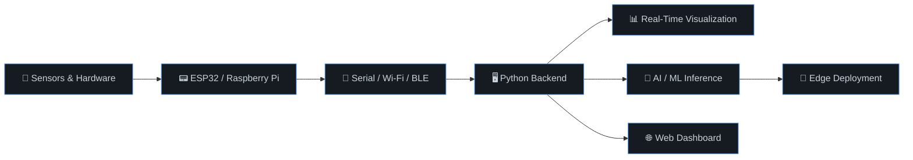

<!-- ═══════════════════════════════════════════════════════════════ -->
<!-- HEADER WAVE -->
<!-- ═══════════════════════════════════════════════════════════════ -->

<!-- Profile views counter -->

  

<!-- ═══════════════════════════════════════════════════════════════ -->
<!-- ANIMATED TYPING -->
<!-- ═══════════════════════════════════════════════════════════════ -->

  

<!-- ═══════════════════════════════════════════════════════════════ -->
<!-- ABOUT ME -->
<!-- ═══════════════════════════════════════════════════════════════ -->

## 🧑‍💻 About Me

I'm an engineer based in India with **8+ years of experience** building systems that connect **hardware, software, and AI**.

My work spans from **ESP32-based edge AI** and **real-time sensor visualization** to **computer vision pipelines**, **Raspberry Pi deployments**, **LLM-powered apps**, and **full-stack dashboards**.

I don't just write code — I build products that **ship on real hardware** and **solve real problems**.

- 🔭 Currently building **Edge AI systems** and **IoT automation solutions**
- 🧠 Exploring **TinyML**, **LLM agents**, and **hardware-AI integration**
- ⚡ I enjoy the full pipeline: **sensor → firmware → backend → visualization**
- 🌍 Open to collaboration on **embedded AI**, **CV**, and **IoT** projects
- 📫 Reach me on [LinkedIn](#) or open an issue on any repo

 

<!-- ═══════════════════════════════════════════════════════════════ -->
<!-- TECH STACK -->
<!-- ═══════════════════════════════════════════════════════════════ -->

## 🛠️ Tech Stack

<b>Languages</b>

 

  
  
  
  
  
  
  

<b>Embedded & Hardware</b>

 

  
  
  
  
  

<b>AI / ML / Computer Vision</b>

 

  
  
  
  
  

<b>Web & App Development</b>

 

  
  
  
  
  

<b>Tools & Platforms</b>

 

  
  
  
  
  
  

<!-- ═══════════════════════════════════════════════════════════════ -->
<!-- GITHUB STATS (LIVE) -->
<!-- ═══════════════════════════════════════════════════════════════ -->

## 📊 GitHub Stats

  <picture>
    
  </picture>
  <picture>
    
  </picture>

<!-- Contribution Graph -->

  

<!-- ═══════════════════════════════════════════════════════════════ -->
<!-- FEATURED PROJECTS -->
<!-- ═══════════════════════════════════════════════════════════════ -->

## 🚀 Featured Projects

<table>
<tr>
<td width="50%" valign="top">

### 🧠 Drowsiness Detection — ESP32-S3

**Edge AI drowsiness detection** running TensorFlow Lite inference directly on **ESP32-S3**. On-device ML with real-time performance.

`TinyML` `ESP32-S3` `TFLite` `Edge AI`

</td>
<td width="50%" valign="top">

### 📡 MPU6050 Real-Time Visualizer

**Real-time 3D IMU visualization** — ESP32 streams MPU6050 sensor data to a Python desktop app with OpenGL rendering and live plots.

`ESP32` `IMU` `PyQtGraph` `OpenGL`

</td>
</tr>
<tr>
<td width="50%" valign="top">

### 👁️ Face Attendance System

**CV-powered attendance** system with face recognition, camera diagnostics, and **Raspberry Pi** deployment support.

`OpenCV` `Raspberry Pi` `Face Recognition`

</td>
<td width="50%" valign="top">

### 💬 NL2SQL

**Natural language to SQL** — ask questions in English, get database queries. Built with **LangChain + OpenAI + MySQL**.

`LangChain` `OpenAI` `MySQL` `LLM`

</td>
</tr>
<tr>
<td width="50%" valign="top">

### 📺 Ad Display — Pi + Next.js

**Digital signage system** running on Raspberry Pi with a **Next.js** frontend for content management and display.

`Next.js` `Raspberry Pi` `Digital Signage`

</td>
<td width="50%" valign="top">

### 🔮 More Coming Soon...

Currently working on new projects in:

- **Edge AI + Sensor Fusion**
- **LLM-powered IoT control**
- **Real-time anomaly detection**

⭐ Star my repos to stay updated!

</td>
</tr>
</table>

<!-- ═══════════════════════════════════════════════════════════════ -->
<!-- WHAT I DO — VISUAL BREAKDOWN -->
<!-- ═══════════════════════════════════════════════════════════════ -->

## ⚙️ What I Do

<!-- ═══════════════════════════════════════════════════════════════ -->
<!-- CURRENT FOCUS -->
<!-- ═══════════════════════════════════════════════════════════════ -->

## 🎯 Current Focus

  
  
  
  

- Building **embedded AI systems** that run inference on microcontrollers
- Integrating **sensors → firmware → cloud/dashboard** end-to-end
- Exploring **LLM agents** that can interact with physical hardware and real-world data
- Developing **computer vision** solutions for industrial and automation use cases

<!-- ═══════════════════════════════════════════════════════════════ -->
<!-- CONNECT -->
<!-- ═══════════════════════════════════════════════════════════════ -->

## 🤝 Let's Connect

  
  &nbsp;
  
  &nbsp;
  

  <i>💡 I enjoy building products at the intersection of <b>Embedded Systems + AI + Visualization + Full-Stack</b>.</i> 
  <i>If you're working on <b>IoT</b>, <b>edge AI</b>, <b>computer vision</b>, or <b>hardware-software integrated systems</b> — let's talk.</i>

<!-- ═══════════════════════════════════════════════════════════════ -->
<!-- SNAKE ANIMATION -->
<!-- ═══════════════════════════════════════════════════════════════ -->

<picture>
  <source media="(prefers-color-scheme: dark)" srcset="https://raw.githubusercontent.com/Sandhu93/Sandhu93/output/github-snake-dark.svg" />
  <source media="(prefers-color-scheme: light)" srcset="https://raw.githubusercontent.com/Sandhu93/Sandhu93/output/github-snake.svg" />
  
</picture>

<!-- FOOTER WAVE -->

